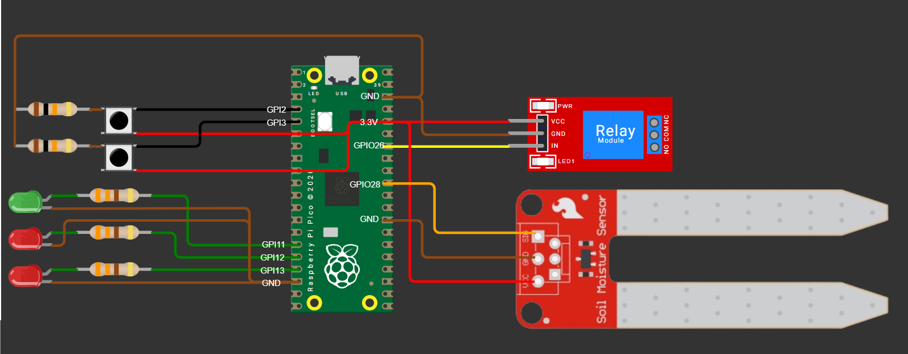
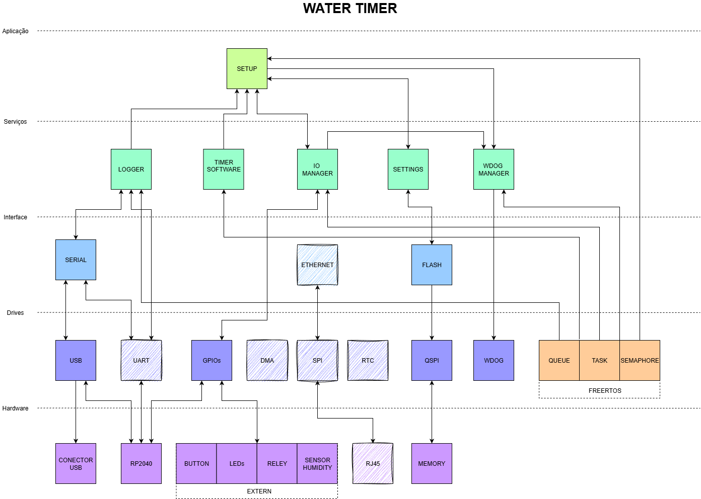
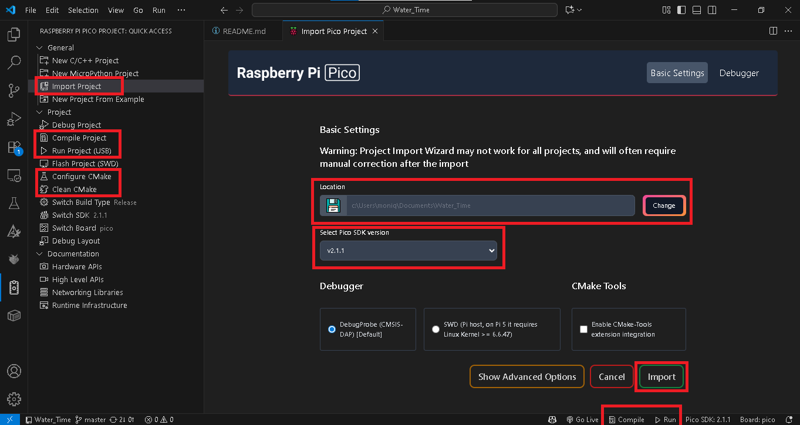

# Water_Timer 🚰🌱

## Projeto Water Timer: Protótipo de Sistema Embarcado para Irrigação Inteligente

O Water Timer é um protótipo de sistema embarcado desenvolvido em C com o objetivo de monitorar e controlar a irrigação de plantas de forma inteligente e eficiente. Este projeto é focado em demonstrar a aplicação de conceitos de Sistemas Operacionais em Tempo Real (RTOS) e arquitetura de software em camadas para microcontrolador RP2040 (Raspberry Pico 2020).

### Objetivo Central
Criar um dispositivo embarcado que regula a vazão de água e o tempo de irrigação com base na umidade do solo e em perfis de cultivo pré-definidos.

### Funcionalidades do Protótipo
Monitoramento de Umidade: Leitura contínua da umidade do solo através de sensores ***SENSOR HUMIDITY***.

Controle Automatizado: Acionamento de válvulas(**RELÉ**) para controlar a vazão de água, garantindo que a planta receba água apenas quando necessário.

Configurações Irrigação: Possibilidade de definir tempo de irrigações, melhorando a precisão do manejo controlando a qunatidade de água.
## Circuito e Pinout

### Componentes

| Componente | Quantidade | Funcionalidade |
| :--- | :--- | :--- |
| Butões | 2 | Incrementa e Decrementa configurações|
| Led vermelho | 2 | Feedback de configurações |
| Led verde | 1 | Feedback de valvula aberta |
| Resistor 330 ohm | 3 | Regular a tensão que vai para LEDs |
| Resistor 10K ohm | 2 | Pull down botões |
| Relé | 1 | Ativar bomba de água |
| Sensor Humidade | 1 | Feedback de quantidade de água |

### Pinout 

| Componente | GPIO | 
| :--- | :--- |
| Butões 1 | 2 |
| Butões 2 | 3 |
| Led  vermelho (Bit 1) | 12 |
| Led vermelho (Bit 2) | 13 |
| Led verde | 11 |
| Relé | 28 | 
| Sensor Humidade | 26 |
| GND | 4, 6 e 8|
| VCC  | 3.3V |



## Especificações

Este documento descreve a arquitetura de software em camadas do sistema de irrigação inteligente **WATER TIMER**, desenvolvido para um microcontrolador **RP2040** rodando o **FreeRTOS**. A estrutura em camadas visa garantir a manutenibilidade, o baixo acoplamento e a separação clara de responsabilidades (Separation of Concerns).



[Draw IO: Arquitetura](https://drive.google.com/file/d/12xOhJRqfqJ655gAyomHIFOzVmu6b6NAL/view?usp=sharing)

**Nota: Os modulos rachurados, são modulos que não serão usado nesta aplicação.**

## 1. Estrutura Arquitetural em Camadas

A arquitetura do `WATER TIMER` é dividida em cinco camadas principais, com a dependência fluindo, em sua maioria, de cima para baixo.

| Camada | Propósito Principal | Exemplos de Módulos |
| :--- | :--- | :--- |
| **5. Aplicação** | Ponto de entrada e lógica principal de inicialização. | `SETUP` | `WATER_TIMER`|
| **4. Serviços** | Lógica de negócio de alto nível e *middleware*. | `LOGGER`, `TIMER SOFTWARE`, `SETTINGS` |
| **3. Interface** | Abstração funcional de *drivers* de baixo nível. | `SERIAL`, `FLASH` |
| **2. Drives** | Abstração de Hardware (HAL) e **Kernel RTOS**. | `USB`, `UART`, `GPIOs`, `FREERTOS` |
| **1. Hardware** | Componentes físicos do sistema. | `RP2040`, `RELEY`, `SENSOR HUMIDITY` |

---

## 2. Detalhamento dos Módulos

Esta seção detalha a função de cada componente de software dentro de sua respectiva camada.

### Camada Aplicação (Application)

| Módulo | Responsabilidade |
| :--- | :--- |
| `WATER_TIMER` | Ponto de entrada do sistema. Inicializa o FreeRTOS, *drivers* e todos os Módulos de Serviço. |
| `SETUP` | Gerenciar e configurar o sistema para controle dos periféricos. |

### Camada Serviços (Services)

| Módulo | Responsabilidade |
| :--- | :--- |
| `TIMER SOFTWARE` | Implementa a lógica de agendamento de alto nível (ex: ciclo de irrigação) utilizando os recursos de *timer*. |
| `IO MANAGER` | Gerencia o estado e o controle de E/S do sistema (leitura de botões, controle de relé, leitura de ADC e LEDs). |
| `SETTINGS` | Gerencia a leitura, escrita e persistência de dados de configuração na memória flash. |
| `LOGGER` | Gerencia a formatação e a saída de mensagens de *log* e *debug*. |
| `WDOG MANAGER` | Serviço que configura e alimenta o *Watchdog Timer* (`WDOG`) para segurança e resiliência do sistema. |

### Camada Interface (Interface)

| Módulo | Responsabilidade |
| :--- | :--- |
| `SERIAL` | Abstrai a comunicação serial, unificando `USB` e `UART` em uma única interface lógica para os Serviços. |
| `FLASH` | Abstrai o acesso à memória não volátil (`QSPI`), fornecendo uma interface de leitura/escrita simples para o módulo `SETTINGS`. |

### Camada Drives (Drivers / HAL + RTOS)

Esta camada inclui o kernel do FreeRTOS, que fornece o ambiente multitarefa.

| Módulo | Tipo | Responsabilidade |
| :--- | :--- | :--- |
| `FREERTOS` | Kernel RTOS | Base para o sistema concorrente (Agendamento, Tempo). |
| `UART`, `USB` | Driver Periférico | Drivers de baixo nível para comunicação serial e USB. |
| `GPIOs` | Driver Periférico | Controle de pinos de propósito geral (E/S). |
| `QSPI` | Driver Periférico | Acesso rápido à memória flash externa. |
| `WDOG` | Driver Periférico | Controle do *Watchdog Timer* de hardware. |

### Camada Hardware (Hardware)

| Módulo | Descrição |
| :--- | :--- |
| `RP2040` | Microcontrolador principal do sistema. |
| `RELEY`, `LEDs`, `BUTTON` | Atuadores e sensores básicos de E/S. |
| `SENSOR HUMIDITY` | Sensor responsável pela leitura da umidade do solo. |
| `MEMORY` | Módulo de memória externa persistente. |
| `CONECTOR USB`| Conectores físicos de comunicação. |

---

## 📋 Requisitos

- [Raspberry Pi Pico SDK](https://github.com/raspberrypi/pico-sdk)
- [CMake](https://cmake.org/download/) (>= 3.13)
- [ARM GCC Toolchain](https://developer.arm.com/downloads/-/arm-gnu-toolchain-downloads)
- **Git** (para clonar o projeto e submódulos)
- **Visual Studio Code** com extensões:
  - *C/C++*
  - *CMake Tools*
  - *Raspberry Pi Pico Project*

---

## ⚙️ Instalação do Pico SDK

Você pode instalar a SDK tanto pelo **VSCode** quanto pelo **terminal**.

### 🔹 Pelo VSCode
1. Instale a extensão [**Raspberry Pi Pico**].
2. Ao instalar essa extensão, outras dependências, como CMake e Python, serão baixadas automaticamente, pois são necessárias para o funcionamento do projeto.
3. 
### 🔹 Pelo Terminal (Linux / WSL / macOS)
```
# Baixe as bibliotecas necessárias:
sudo apt install cmake python3 build-essential gcc-arm-none-eabi libnewlib-arm-none-eabi libstdc++-arm-none-eabi-newlib -y

# Clone o SDK para o projeto
git clone -b master https://github.com/raspberrypi/pico-sdk.git
cd pico-sdk
git submodule update --init --recursive

# Adicionar o caminho do patch
export PICO_SDK_PATH=$HOME/pico-sdk

```

Para mais detalhes, consulte o repositório oficial da SDK do Raspberry Pi Pico: https://github.com/raspberrypi/pico-sdk/tree/master?tab=readme-ov-file

## ⬇️ Clonando o Repositório

Este projeto usa o **FreeRTOS-LTS como submódulo**.  
Por isso, é importante clonar com a opção `--recurse-submodules`:

```bash
git clone --recurse-submodules https://github.com/MoniqueMoreira/Water_Time.git
cd water_time
```

Se você já clonou sem essa opção, rode:

```bash
git submodule update --init --recursive
```

---

## 🛠️ Compilando o Projeto

### Pelo VSCode
1. Abra a extensão do Raspberry Pi Pico instalada anteriormente.  
2. Selecione **“Importar Projeto”**.  
3. Escolha o diretório onde o repositório foi clonado.  
4. Na seleção de versão, escolha **2.1.1** (a versão 2.2.0 apresenta problemas).  
5. Clique em **“Importar”**.  
6. Aguarde o projeto ser carregado completamente e configure o CMake.  
7. Compile o projeto e faça o upload para o microcontrolador **RP2040 (Raspberry Pi Pico 2020)**.  

   > ⚠️ Atenção:  
   > - Se a placa estiver zerada, será necessário usar o botão **BOOTSEL** para colocá-la em modo de boot.  
   > - Caso já tenha feito esse processo ao menos uma vez, também é possível reiniciar em modo boot pelo terminal com o comando:  
   >   ```bash
   >   picotool reboot -u -f
   >   ```




### Pelo Terminal
```bash
mkdir build
cd build
cmake ..
make -j4
```

Isso vai gerar um `.uf2` dentro da pasta `build/`.

---

## 🚀 Gravando no Pico

1. Conecte o Raspberry Pi Pico no PC **segurando o botão BOOTSEL**.
2. Monte a unidade USB que aparece.
3. Copie o arquivo `.uf2` para dentro dela.

Pronto! Seu Pico está rodando o **Water_Time** 🎉

---
